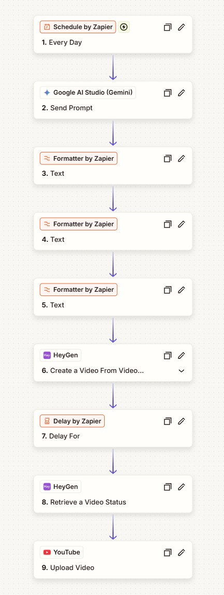

# Automated Video Production Pipeline: End-to-End Content Orchestration Engine

## Business Problem Statement
Scaling short-form video content across channels like YouTube Shorts creates a massive operational bottleneck. The manual process requires a content creator to research topics, write scripts, format descriptions, generate video assets, wait for rendering to finish, and manually upload the final files. This manual loop limits content output and leads to frequent human errors like formatting bugs, missed tags, or incorrect compliance settings.

This project solves those inefficiencies by creating a fully automated data pipeline. By linking an AI engine, a regular expression parser, an automated video generator, and deployment APIs, this workflow converts a single topic input into a fully produced, compliant video draft ready for publication with zero manual effort.

## System Architecture & Data Flow
The pipeline uses a multi-step automation architecture built in Zapier to manage data extraction, handle timing delays, and connect third-party APIs.

* **Trigger:** A scheduled timer or webhook event kicks off the daily workflow by passing the target video topic into the pipeline.
* **AI Generation Layer (Google Gemini):** The topic goes directly into Google AI Studio (Gemini). It creates the raw text payload, which includes both the video script and the SEO metadata. To keep the output organized for the next steps, Gemini wraps the data in custom text tags like `[SCRIPT START]` and `[METADATA START]`.
* **Data Transformation Layer (Zapier Formatter & Regex):** Because Gemini outputs a single block of text, the pipeline uses text formatting steps running regular expressions to break it apart. 
  * The first splitter isolates the voiceover text using the pattern: `\[SCRIPT START\]([\s\S]*?)\[SCRIPT END\]`
  * The second splitter separates the title and the description from the metadata block using the pattern: `Title:\s*(.+)\s+Description:\s*([\s\S]+)`
* **Video Generation Layer (HeyGen Video Agent):** The extracted voiceover script is sent to the HeyGen Video Agent. The agent reads the text and automatically adds relevant background visuals, b-roll graphics, and burns captions directly into a vertical 9:16 layout.
* **Timing & Data Retrieval (Delay by Zapier):** Video rendering takes time. The pipeline triggers a 15-minute delay step to let the video finish processing. Once the time is up, a "Retrieve Video Status" step queries the HeyGen API using the Video ID to pull the direct `.mp4` video URL.
* **Final Deployment (YouTube Data API):** The pipeline maps the split title, the formatted description text, and the raw captioned video URL directly into the YouTube Upload action. It automatically flags required settings like setting "Made for Kids" to False and keeping the upload Private for review.


<p align="center">
  
</p>


## Code & Prompt Engineering Breakdown

### Data Processing Script
The Python script below mirrors the exact regular expression parsing logic handled by the Zapier text formatting steps to turn unstructured text into clean data variables:

```python
import re

def clean_and_split_metadata(raw_input_text):
    # 1. Isolate the core voiceover script
    script_regex = r"\[SCRIPT START\]([\s\S]*?)\[SCRIPT END\]"
    script_match = re.search(script_regex, raw_input_text)
    voiceover_script = script_match.group(1).strip() if script_match else None
    
    # 2. Isolate the combined metadata block
    metadata_regex = r"\[METADATA START\]([\s\S]*?)\[METADATA END\]"
    metadata_match = re.search(metadata_regex, raw_input_text)
    
    video_title = None
    video_description = None
    
    # 3. Split the metadata block into independent Title and Description variables
    if metadata_match:
        clean_metadata = metadata_match.group(1).strip()
        field_regex = r"Title:\s*(.+)\s+Description:\s*([\s\S]+)"
        field_match = re.search(field_regex, clean_metadata)
        if field_match:
            video_title = field_match.group(1).strip()
            video_description = field_match.group(2).strip()
            
    return {
        "script": voiceover_script,
        "title": video_title,
        "description": video_description
    }

# Simulation of the raw Gemini payload passing into the parser
sample_payload = """
[SCRIPT START]
There is a massive patch of the universe where stars simply do not exist. It is called the Bootes Void, a terrifying expanse of nothingness.
[SCRIPT END]

[METADATA START]
Title: The Terrifying Empty Space in Our Universe
Description: Deep in space lies a massive void that shouldn't exist, stretching millions of light-years across.
#didyouknow #spacefacts
[METADATA END]
"""

parsed_data = clean_and_split_metadata(sample_payload)
print(f"Parsed Title: {parsed_data['title']}")
print(f"Parsed Script: {parsed_data['script']}")
